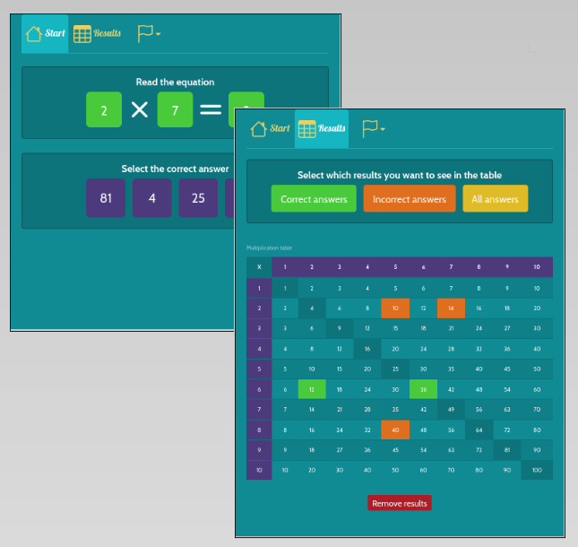

# Multiplication table learning app

This an application used by kids to memorize multiplication table. Makes use of Redux Toolkit to manage global state, and a dedicated slice with internationalization methods. UI built with Bootstrap v3.

## Table of contents

- [Overview](#overview)
  - [Description](#description)
  - [Screenshot](#screenshot)
  - [Links](#links)
  - [Start](#start)
- [Built with](#built-with)
- [Author](#author)

## Overview

### Description

Features:

- The user needs to select a correct result of multiplication of two numbers.
- Results are saved and can be viewed in a dedicated screen.
- Language (based on browser's settings) is PL or EN, it can also be changed manually.
- History of answered questions is stored in the user's browser.

### Screenshot

Solution screenshot

### Links

- Live Site URL: [multiplication.vercel.app](https://multiplication.vercel.app/)

### Start

To start the project locally go tot the the project directory and run:
`yarn start` or `npm start`
Open [http://localhost:3000](http://localhost:3000) to view it in the browser.

## Built with

- [React](https://reactjs.org/)
- [React Router](https://reactrouter.com/en/main)
- [React Redux](https://redux.js.org/)
- React testing library
- [Bootstrap v3.4.0](https://getbootstrap.com/)

## Author

- Website - [linkedin](https://www.linkedin.com/in/artur-jedrzejczak/)
- Profile - [profile website](https://artur-jedrzejczak.vercel.app/)
